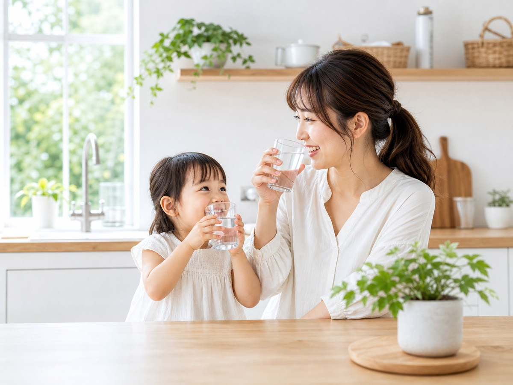

# CLUB ECO WATER ランディングページ（新デザイン）

「家計・安心・毎日使うもの」という生活者目線から入る、
**青・白・ナチュラルカラー基調／親しみやすさ・安心感・信頼感**を重視したLPです。

---

## 📁 ファイル構成

```
club-eco-water/
├─ index.html        本体（9セクション）
├─ css/
│   └─ style.css     デザイン一式（モバイルファースト）
├─ js/
│   └─ app.js        スクロール表示・固定CTAバー
├─ images/           写真を入れるフォルダ（下記の仕様で差し替え）
└─ README.md         このファイル
```

ブラウザで `index.html` を開けば、そのまま表示できます（写真は仮置き枠の状態）。

---

## 🎨 デザインの考え方

| 項目 | 内容 |
|---|---|
| トーン | 親しみやすさ・安心感・信頼感（高級感は控えめ） |
| 色 | 青（水）＋白＋新緑グリーン＋やわらかいベージュ |
| 見出しフォント | Zen Maru Gothic（やさしい丸ゴシック） |
| 本文フォント | Noto Sans JP |
| 構成 | 商品説明から入らず「家計→共感→気づき→解決→比較→声→物語→安心→決断」の流れ |

---

## 🧱 セクション構成（依頼書どおり）

1. **ファーストビュー** … 「毎月の水代、高すぎませんか？」＋3つのCTA
2. **共感パート** … こんなお悩みありませんか？（チェックリスト）
3. **現状認識** … 月にいくら水に使っていますか？（図解＋年間48万円）
4. **解決策** … 水道水から作るという選択（5つの特徴＋サーバー写真）
5. **コスト比較** … ペットボトル／一般サーバー／ECOウォーターの比較
6. **利用者の声** … 写真付き4件
7. **ストーリー** … 佐々木えり様のストーリー
8. **安心材料** … 全国で愛用・長年・体験会・説明会
9. **クロージング** … 「毎日続けられる選択を。」＋3つのCTA＋紹介者情報

---

## 🔗 CTAリンク（ここを差し替えてください）

現在のリンク設定は以下のとおりです。`index.html` 内を検索して書き換えてください。

| ボタン | 現在の設定 | やること |
|---|---|---|
| 申込みフォーム | `https://potapotaclub.jp/newentry/` | ✅ 旧LPのリンクを設定済み（紹介者 ササキエリ／ID 442981） |
| LINE登録 | `#line`（仮） | LINE公式アカウントのURLに差し替え |
| 説明会に参加 | `#contact`（ページ内移動・仮） | 説明会の申込フォーム/予約URLがあれば差し替え |

> 検索する文字：`#line` … LINEボタン全部 ／ `#contact` … 説明会ボタン
> 申込みURLは `potapotaclub.jp` で検索すると見つかります。

---

## 🖼 写真の差し替え（仮置き枠の一覧）

今は「📷 ファイル名／サイズ／内容」と書かれた**仮置き枠**が表示されています。
`images/` フォルダに同じファイル名で写真を入れ、`index.html` の該当 `<div class="ph ...">` を
`` に置き換えると写真が入ります。

| # | ファイル名 | 推奨サイズ | 内容 |
|---|---|---|---|
| FV | `01_fv-family.jpg` | 1200×900 | 家族でキッチン、コップのお水を飲む明るい写真 |
| 解決策 | `04_server.png` | 900×1100 | サーバー本体（背景白・余白広め） |
| 声① | `06_voice-01.jpg` | 400×400 | お水を飲むお子さんの笑顔 |
| 声② | `06_voice-02.jpg` | 400×400 | ペットボトル置き場がスッキリ |
| 声③ | `06_voice-03.jpg` | 400×400 | お水でお料理しているシーン |
| 声④ | `06_voice-04.jpg` | 400×400 | ゴミが減ったスッキリした暮らし |
| ストーリー | `07_profile-eri.jpg` | 800×1000 | 佐々木えり様の自然な笑顔のポートレート |

写真は WEBP に変換すると軽くて高速です（任意）。

### 写真の入れ方（例：FV）

```html
<!-- before（仮置き枠） -->
<div class="ph ph--fv" data-ph="01_fv-family.jpg ／ ...">
  <span class="ph__label">FVメインビジュアル</span>
</div>

<!-- after（写真を入れる） -->

```

> 写真をそのまま入れると角丸・影が消えます。同じ見た目にしたい場合は
> `class="ph--fv"` のスタイルに合わせて `border-radius` と `box-shadow` を付けてください。
> （差し替え時にお手伝いできますので、お気軽にどうぞ）

---

## 📊 確認用の数字（依頼書ベース）

| 項目 | 値 |
|---|---|
| 2Lペットボトル | 約100円 |
| 1人1日に必要な水 | 1.5〜2L |
| 家族4人・年間（試算例） | 48万円以上 |
| ペットボトル年間 | 36,000〜72,000円 |
| 一般的なウォーターサーバー年間 | 50,000〜100,000円 |
| ECOウォーター | 1Lあたり約19〜25円 |

> ※すべて「利用状況により変動」の注記つきで掲載しています。

---

## ✅ 表示の確認方法

1. `index.html` をダブルクリック → ブラウザで開く
2. スマホ幅（〜480px）が基準。PCでは中央寄せで自動調整されます
3. 更新が反映されないときは強制リロード（**Ctrl + Shift + R**）

---

## 📝 メモ

- 文中の専門的な話（PFAS・農薬・除去性能など）は**あえて前面に出さず**、
  「家計・安心・毎日使うもの」から入る構成にしています。
  必要なら、解決策セクション内に「実はこだわっています」枠として後出しで追加できます。
- Git連携・公開（GitHub Pages等）は、リポジトリ作成後にいつでもお手伝いします。
